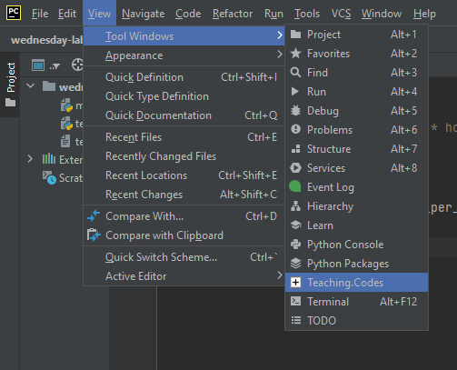

# Frequently Asked Question (FAQ)

1. How can I install the software required for this course?
   
* Follow the [Installation Guide](InstallationGuide.md).
   
2. How can I update Teaching Codes Plugin?
   
* Follow the [Teaching Codes Update Guide](TeachingCodesGuide.md)
   
3. How can I open/submit a project?
   
* Follow the [Teaching Codes Guide](TeachingCodesGuide.md)
   
4. I encountered an error during installation/using Teaching Codes, how can I get help?
   
* Check the questions/solutions in this document and then Technical Support Forum on Moodle. If you can't find the solution, send an email to cmpe150.mail@gmail.com.
   
7. Teaching.Codes Plugin displays 'Nothing to show'
   * If you have a Macbook with M1 chip
      
      * Make sure that you install PyCharm 2021.2.2 for Intel with Rosetta 2.
      * Then follow the next steps in [Installation Guide](InstallationGuide.md)
      * You may also have to disable SIP following [this link](https://developer.apple.com/documentation/security/disabling_and_enabling_system_integrity_protection).
   * Otherwise,
      * Make sure you do not extract the Teaching.Codes zip file. 
      * Download the Teaching.Codes zip using Chrome instead of Safari.  
      * Then, reinstall the plugin by following [Teaching.Codes guide](TeachingCodesGuide.md)  
8. I can't see the button names in the plugin 

   * Change the theme by following these steps:

     * Inside PyCharm, for Windows, click ***File-->Settings***; for MacOS, click ***PyCharm-->Preferences*** and find ***Appearance&Behavior*** on the left. 
     * Go into **Appearance** under ***Appearance&Behavior*** 
     * Change Theme from Intellij Light to something else. (**Darcula** seems fine.)
     * Click **OK**

     
9. Teaching.Codes plugin disappeared 
   * To open the plugin, click *View > Tool Windows > Teaching.Codes*
   
      

10. I have deleted the contents of **Main.py** 
   * Restore it from **Main.py.txt** under corresponding question's **src** folder

     

11. I can't see the Question description 
   * Open the **Question.html** under **WebContent** in a browser
   * Right click on **Question.html** file
   * Click **Open in Browser.** 

    

12. If there are multiple questions and you see the same description for both questions or still blank page. 

   * Right click on **Question.html** file
   * Choose "**Show in Explorer/Finder**". This step open the folder that contains the html file.

      

   * From the folder, open the html file.

13. I can't see the Exam Results 

    * Log out, and log in to the Teaching.Codes plugin.	
    * Select the class from the Navigator. Wait a while for the class to load. 
    * Click the ExamResults tab. When you click Open under a question, if nothing is happening:
      * Click the Projects tab on the left of ExamResults
      * Then, go into ExamResults once again. Now, when you click Open, you should be able to see your results. 

14. What counts as **cheating**:
    * **Information exchange between students:** Giving and Receiving information to/from your colleagues both count as cheating.
    * **Using codes from any source other than the materials of our course:** You can consult internet or books to learn and improve your programming skills. But you shouldn't use any material that is not your own work in the projects and exams.
