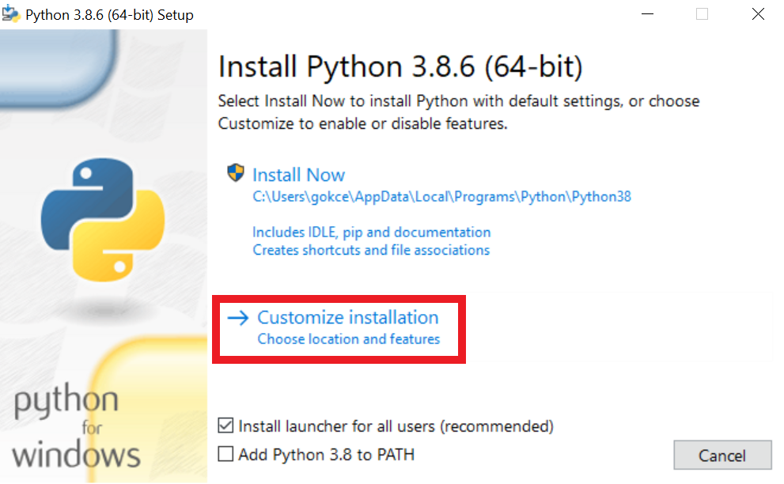
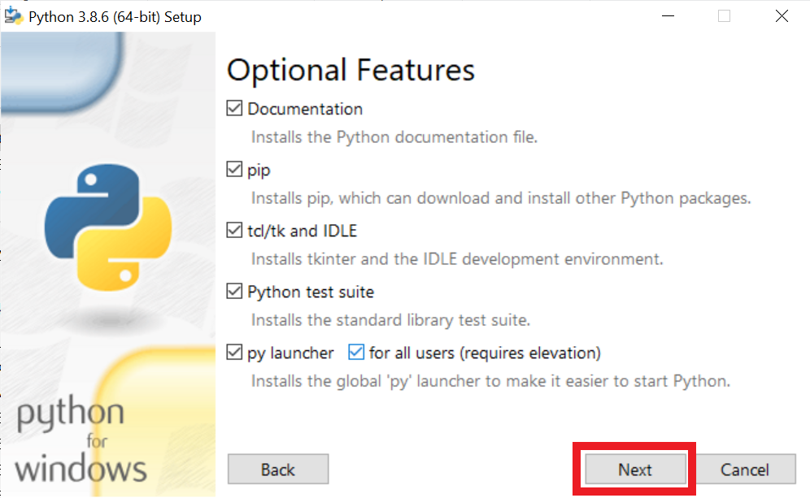

# Installation Guide for CMPE 150

This document describes the steps for installing the necessary software for the CMPE 150 Introduction to Computing course. You will need to install the following:

- python3
- PyCharm
- Teaching.Codes plugin

You can find pdf version of this file [here](InstallationGuide.pdf)

#### Problems

If you encounter a problem during installation, first check **[FAQ](FrequentlyAskedQuestions%20(FAQ).md)** on GitHub and **Collaboration Forum for Students** on Moodle. If you can't find the solution to your problem, describe the problem with the template below and post it to **Collaboration Forum for Students**.

**Operating System:** Specify your operating system: Windows/Linux/MacOS

**Step:** Specify the installation step you got the error: (e.g. Install Python)

**Error:** Describe the error. Paste the error or upload a screenshot showing the error.

If the problem still continues, send an email to cmpe150.mail@gmail.com.

## Instructions  <a name="instructions"></a>

Step by step instructions for installing these software are provided below for the Windows, MacOS, and Linux operating systems.

## Install Python

### Windows <a name="py-win"></a>

**If Microsoft Store is supported in your computer:**

1. Go to Microsoft Store, type python 3.8 in the search bar. Download python 3.8.

2. To check if python3.8 is installed, press the Windows button, then type:	

   ```bash
   cmd
   ```

   and press Return (enter), thus opening the Command Prompt. Type:

   ```bash
   python --version
   ```

   and press Return (enter).

   If you see Python 3.8.x (3.8.6 etc.), python 3.8 has been successfully installed.

   If your Windows username has spaces in it (e.g. "Jane Doe"), you may encounter problems in the next steps. In that case, uninstall python from the store and follow the instruction steps below.

**If Microsoft Store is not supported in your computer:**

1. Go to https://www.python.org/downloads/release/python-386/. Navigate to *Files* section. 

2. Download the installer.

   - **Windows x86-64 executable installer** if you're using 64 bit-Windows 
   - **Windows x86 executable installer** if you're using 32 bit-Windows

   To check whether you're using a 32 bit or 64 bit version of Windows: Select the *Start* button, type Computer in the search box, right-click on *Computer*, and then select *Properties* and check *System Type*. 

3. Run the installer

   * Once installation is started, click *Customize Installation*

     

   * Then, click *Next*

     

   - Under Advanced Options, 

     - Check *Install for all users*
     - Note the installation location (the one inside black box.), you will need to tell PyCharm to go there to select the interpreter
     - Then, click *Install*.

     

     

### Linux (Ubuntu/Debian) & MacOS Catalina and later

*  Download Python from the official website.
  * MacOS: https://www.python.org/ftp/python/3.8.6/python-3.8.6-macosx10.9.pkg
  * Linux: 
    * gzipped → https://www.python.org/ftp/python/3.8.6/Python-3.8.6.tgz
    * tar.xz → https://www.python.org/ftp/python/3.8.6/Python-3.8.6.tar.xz
* Install Python from the downloaded file. 
  * MacOS
    * Double-click the package to install Python.
  * Linux 
    * Extract the file
    * Open the *README* file and see the section on *Build Instructions.*
    * Apply the commands written there, but if you wish not to have this version as your primary, instead of the last command `sudo make install` execute `sudo make altinstall`

* To check whether the installation is successful,

  * Open a terminal

  * Type the following and press Return (Enter).

    ```bash
    python3.8 -V 
    ```

     If you see Python 3.8, your installation has been successful.

* To find out where this Python version is installed, on the same terminal window, type:

  ```bash
  which -a python python3 
  ```

  and press Return (Enter).  All the Python versions installed on your system will be listed. Note the location of Python3.8 for later. 

## 2. Install PyCharm <a name="pycharm"></a>

* Go to https://www.jetbrains.com/pycharm/download/other.html 
* Choose your operating system (Windows, MacOS or Linux) and download from the “Community” or “Professional” option. Both work the same for the purposes of this course.
* Version 2021.3.2 is compatible with out plugin. But, if you encounter any errors, try downgrading to version 2021.2.2. If you have other versions, please upgrade/downgrade to one of these versions.
* After the download finishes, install PyCharm. Your computer may not trust applications downloaded from the web, if so change this from your system preferences or trust this source in the appearing dialog. The installation will begin, accept the license agreement and choose your settings like the dark theme, create a launcher script if you wish (you don’t need to), and
  you will not need any plugins it shows you.
* After the installation, run **PyCharm**. License Activation window will appear if you chose “*Professional*”. You can get a free student license with your university email (with the boun extension) from JetBrains here: https://www.jetbrains.com/community/education/#students. Enter your license information and activate your license.
* **Welcome to PyCharm** window should appear.

## 3. Create a new project <a name="project"></a>

* Click on the *New Project* button. From the window that comes up, choose *Pure Python* from the left side if you are using the Professional edition, this is already chosen in Community edition.

* In the options on the right side, you can write a project name of your choosing at the end of the *Location setting* -the one at the top of the window- by deleting the *pythonProject* and writing something like *myFirstProject* or *hello*.

* Then, under *Python Interpreter*, make sure the *New environment using Virtualenv* is checked, and make sure the *Base interpreter* is pointing to **the location of the python you just downloaded**. Windows will usually find this by itself. **In Linux and MacOS**, this may point to the default python which comes pre-installed in your computer; so click the three dots and navigate to the location you noted earlier belonging to python3.8.

  The location should be something similar to what is below:

  ```
  /Library/Frameworks/Python.framework/Versions/3.8/bin/python3
  ```

* Check the *Create a main.py welcome script* for this time and click *Create*. It will take a little while and your project will be created. If you see no errors, everything is in order.


* At the top right of your screen, you will see the section in the image above. Click the *Run button* (big green triangle) and at the bottom of the screen a Run window will appear, and it will have the writing:

  **Hi, PyCharm**

## 4. Install the Teaching Codes Plugin <a name="TC"></a>

* Go to the link for your operating system and download the zip file:

  **Windows:**  

  https://programming.cmpe.boun.edu.tr/downloads/StudentPlugin/TCPluginJetBrains_Windows.zip

  **Linux:** 

  https://programming.cmpe.boun.edu.tr/downloads/StudentPlugin/TCPluginJetBrains_Linux.zip

  **MacOS:**

  For a successful installation, if you are using Safari browser, you need to go to *Preferences* and under the *General* tab, uncheck the option open “safe” files after downloading. Otherwise the downloaded .zip file is automatically extracted and won’t work.

   https://programming.cmpe.boun.edu.tr/downloads/StudentPlugin/TCPluginJetBrains_MacOS.zip

* While PyCharm is open, go to *File>Settings* (just *Preferences* in Mac) and find *Plugin*s on the left.

* Click the gear icon on the top (shown in a red box in the image below) and click *Install Plugin from*
  *Disk…*

  

* Navigate to the location of the zip file and choose it. After a short while “Teaching Codes JB” plugin will appear as downloaded at the top of the plugins list.
* Then you should see Teaching Codes at the right side bottom part of the screen, (shown in a red box in the image below in the image). Click on it and you should see the login screen. You can login with the Teaching Codes information that has been sent to you from `communique@teaching.codes` If you haven't received such an email, contact the teaching assistants.


