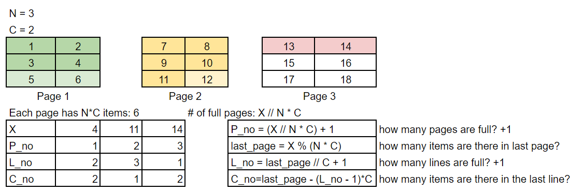

## Question 1

A chemical mixture has 2 components, namely Component X and Component Y. Ask the user for the amount of X and Y in the mixture and then calculate the percentages of X and Y in the total solution.

| Input   | Output        |
| ------- | ------------- |
| 10 10   | 50.00% 50.00% |
| 10.5 21 | 33.33% 66.67% |
| 0.1 0.9 | 10.00% 90.00% |

## Question 2

Write a program that asks the user their height in centimeters (integer) and their weight in kilograms (float). Calculate the user's body mass index (BMI) with the formula given below.

BMI = weight(kg) / height(m)^2

| Input    | Output |
| -------- | ------ |
| 72 180   | 22.22  |
| 79.5 172 | 26.87  |
| 53.4 160 | 20.86  |
| 81.2 165 | 29.83  |

## Question 3

After he visits the "Math Cafe", Emir wants to learn the wi-fi password. He asks the waiter, and the waiter says "The password is the x-1 times of the two least significant bases of 5^5628". Could you write a code that takes x as input and gives the wi-fi password as output?

| Input | Output |
| ----- | ------ |
| 4     | 75     |
| 19    | 450    |

## Question 4

In mathematics and computer science, the [floor function](https://en.wikipedia.org/wiki/Floor_and_ceiling_functions) is the function that takes as input a real number `x`, and gives as output the greatest integer less than or equal to `x`, denoted as `⌊x⌋`. The fractional part is the sawtooth function, denoted by `{x}` for real x and defined by the formula `{x} = x - ⌊x⌋`. 

Write a program that takes 3 positive floats from the input and prints out the fractional part of each value respectively. Do not use float-to-int type casting. There might occur some [floating-point error](https://www.geeksforgeeks.org/floating-point-error-in-python/), you do not have to deal with that.
*Hint: Integer division by 1 can be helpful to find* `⌊x⌋`*. Notice that for negative numbers, we have to perform extra steps to find* `⌊x⌋`.

| Input             | Output         |
| ----------------- | -------------- |
| 4.8 6.4 3.5       | 0.8 0.4 0.5    |
| 67.32 23.53 13.98 | 0.32 0.53 0.98 |
| 65.12 49.32 30.09 | 0.12 0.32 0.09 |

# Function

## Question 5

We want to simulate a division operation. In order to do that, write a function that takes two integers, dividend and divisor respectively, perform the division operation and print out the quotient and the remainder.

| Input  | Output                      |
| ------ | --------------------------- |
| 9 2    | quotient = 4 remainder = 1  |
| 156 13 | quotient = 12 remainder = 0 |
| 84 16  | quotient = 5 remainder = 4  |

## Question 6

You are in a biology lab observing reproducing bacteria.

Every daughter cell grows up for a given time (t1) and becomes a parent cell, immediately dividing into two new daughter cells. These daughter cells then start the same process all over again.

Given three integers, one representing **the initial number of bacteria**, one representing **the time it takes daughter cells to become parent cells (t1)**, and one representing **the total timewise length of the experiment.** Write a function that returns the total number of bacteria at the end of the experiment.

| Input | Output |
| ----- | ------ |
| 1 1 2 | 4      |
| 5 3 8 | 20     |

Example

## Question 7

Write a function that takes four integers representing (x, y) coordinates of two points and calculates the distance between these two points. First two integers are x and y coordinates of a point on a 2D plane. Next 2 integers are coordinates of another point on the same plane.

Call this function with the following inputs and print the results:

| Input          | Output |
| -------------- | ------ |
| 5 10 10 22     | 13.00  |
| -5 -10 -10 -22 | 13.00  |

## Question 8

Two runners run around a circular track. 

The first runner runs `x1` meters in a minute. The second runner runs `x2` meters in a minute. Write a function that takes 4 parameters: radius `r` in meters, `x1`, `x2` and total time elapsed in minutes. The function first calculates the circumference of the circular track. Then calculate the completed number of laps so far (integer) by each runner and return them. Take π = 3.14.

Call this function with following inputs and print the number of laps in the format below:

| Input          | Output                                           |
| -------------- | ------------------------------------------------ |
| 100 300 400 30 | First runner = 14 laps - Second runner = 19 laps |
| 25 150 250 15  | First runner = 14 laps - Second runner = 23 laps |
| 35 550 400 10  | First runner = 25 laps - Second runner = 18 laps |

## Question 9

A telephone directory has 20 lines on each page, and each page has exactly 5 columns.

Assume there is an entry in each column. Write a function that determines/returns on which page, column, and line the Xth entry is present. (Assume that page, line, column numbers, and X all start from 1.)

| Input | Output  |
| ----- | ------- |
| 156   | 2 12 1  |
| 2348  | 24 10 3 |

Example

## Question 10

In football, there is a statistic for quarterbacks called the passer rating. It is calculated as follows:

(a) C is the “completions per attempt” times 100 − 30 all divided by 20.

(b) Y is the “yards per attempt” − 3 all divided by 4.

(c) T is the “touchdowns per attempt” times 20.

(d) I is 2.375 minus (“interceptions per attempts” times 35).

(e) The passer rating is the sum of C, Y, T, and I all divided by 6 and then multiplied by 100.

Write a function that takes five parameters: pass completions, pass attempts, total passing yards, touchdowns  and interceptions and returns the passer rating.

| Input             | Output |
| ----------------- | ------ |
| 183 267 2064 17 3 | 106.08 |
| 117 172 1587 12 3 | 110.30 |

## Question 11

The current population of Turkey is ~84.5M.
Three rates of change in population are provided:

* a birth every 15 seconds.
* a death every 20 seconds.
* a new immigrant every 100 seconds

Write a function that takes a year as parameter(as an integer) and prints out an estimated population (as an integer). Assume that there are exactly 365 days in a year.

| Input | Output    |
| ----- | --------- |
| 2030  | 92068640  |
| 2050  | 108887840 |
